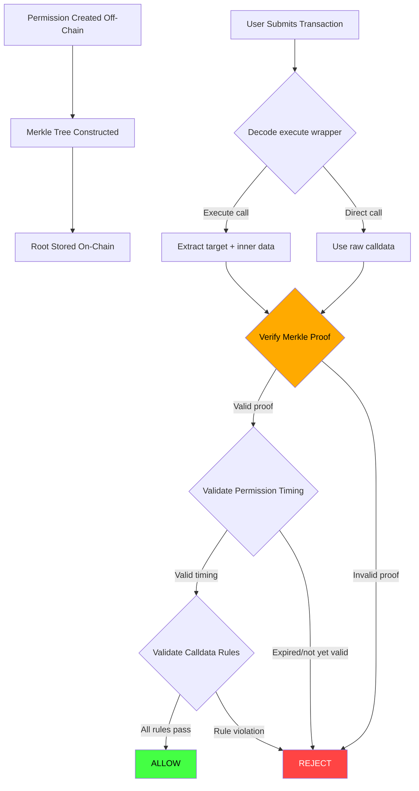

# 🔒 Security Audit Report — `ClankerGateCore` Library

**Audited Code:** `ClankerGateCore.sol` (library)  
**Solidity:** `^0.8.20`  
**Date:** 2026-02-25  
**Auditor:** Antigravity AI Security Review  

---

## Executive Summary

The `ClankerGateCore` library implements policy-based transaction validation with Merkle-tree-verified permissions and calldata parameter rules. The audit identified **2 Critical**, **2 High**, **3 Medium**, and **4 Low/Informational** findings.

| Severity | Count | Status |
|----------|-------|--------|
| 🔴 Critical | 2 | Open |
| 🟠 High | 2 | Open |
| 🟡 Medium | 3 | Open |
| 🔵 Low / Info | 4 | Open |

---

## 🔴 Critical Findings

### C-01: Merkle Leaf Second Pre-Image Attack — Missing Double-Hash

**Location:** `hashPermission()` / `verifyMerkleProof()`

**Description:**  
The leaf is computed as a single `keccak256(abi.encode(...))`. This makes the tree vulnerable to a **second pre-image attack** where an attacker can craft a valid proof for a forged leaf by using an internal node as a leaf.

OpenZeppelin's own documentation and their `MerkleAirdrop` example both recommend **double-hashing** the leaf:

```solidity
// OpenZeppelin recommended pattern:
bytes32 leaf = keccak256(bytes.concat(keccak256(abi.encode(...))));
```

The current code does:
```solidity
// VULNERABLE — single hash
bytes32 leaf = keccak256(abi.encode(...));
```

If the Merkle tree is constructed off-chain using `@openzeppelin/merkle-tree` (which double-hashes by default), and the on-chain verification uses a single hash, **all proofs will fail**. If both sides use single-hashing, the tree is vulnerable to second pre-image attacks.

**Impact:** An attacker can forge permissions that were never granted, completely bypassing the policy system.

**Recommendation:**
```diff
 function hashPermission(Permission memory permission) internal pure returns (bytes32) {
     bytes memory encoded = abi.encode(
         permission.target,
         permission.selector,
         permission.rules,
         permission.validAfter,
         permission.validUntil,
         permission.chainId,
         permission.singleUse
     );
-    return keccak256(encoded);
+    return keccak256(bytes.concat(keccak256(encoded)));
 }
```

---

### C-02: `bytes32` Comparison Treats Signed Values as Unsigned

**Location:** `compareRule()` — operators `OP_GT`, `OP_LT`, `OP_GTE`, `OP_LTE`

**Description:**  
All comparison operators (`>`, `<`, `>=`, `<=`) are applied directly to `bytes32` values. In Solidity, `bytes32` comparisons are **lexicographic (unsigned)**. If the actual intent is to compare `int256` values (e.g., signed prices, rates, or balance deltas), the comparison will produce incorrect results.

For example, a negative `int256` value will have its highest bit set, making it appear **larger** than any positive value when compared as `bytes32`:

```solidity
bytes32 negativeOne = bytes32(uint256(type(int256).max) + 1); // -1 as bytes32
bytes32 positiveOne = bytes32(uint256(1));

// negativeOne > positiveOne → TRUE (wrong if intent is signed comparison)
```

**Impact:** Rules intended to enforce value bounds (e.g., "slippage must be > MIN") can be trivially bypassed if signed values are involved. This is an implicit trust assumption that is nowhere documented.

**Recommendation:**  
Either:
1. **Document clearly** that only unsigned values are supported, OR
2. Add signed comparison operators:
```solidity
uint8 constant OP_SGT = 6; // signed greater than
uint8 constant OP_SLT = 7; // signed less than
// Use int256(uint256(...)) for comparison
```

---

## 🟠 High Findings

### H-01: `decodeExecuteCall` Uses Hardcoded ABI Offsets — Fragile and Bypassable

**Location:** `decodeExecuteCall()` / `decodeExecuteCallMemory()`

**Description:**  
The function assumes a fixed ABI encoding layout for the `execute()` call:

```
[0:4]     selector (0x61461954)
[4:36]    target (address, padded)
[36:68]   value (uint256)
[68:100]  data offset
[100:132] data length
```

However, ABI encoding allows:
- **Non-standard padding** in the address field (upper 12 bytes)
- **Different offset values** pointing to the same data
- **Additional trailing bytes** appended to calldata

The function reads `target` from `callData[16:36]` (skipping the upper 12 zero-pad bytes of the address slot), but it never validates that `callData[4:16]` is actually zero. An attacker could pack arbitrary data into those bytes without affecting the extracted `target`.

More critically, `dataOffset` is read from `callData[68:100]` and used to compute `innerDataOffset = 4 + dataOffset + 32`. If `dataOffset` is manipulated to be a large value, `innerDataOffset` could point past the end of `callData`, creating an **out-of-bounds read** situation (depending on how callers use `innerDataOffset` and `innerDataLength`).

**Impact:** Callers relying on the decoded values may operate on garbage data or skip validation entirely.

**Recommendation:**
```solidity
// Add bounds checking
require(innerDataOffset + innerDataLength <= callData.length, "Invalid execute encoding");
// Validate zero-padding of address
require(bytes12(callData[4:16]) == bytes12(0), "Invalid address padding");
```

---

### H-02: `decodeExecuteCall` Non-Execute Path Returns Misleading Values

**Location:** `decodeExecuteCall()` — `else` branch

**Description:**  
When `selector != EXECUTE_SELECTOR`, the function returns:
```solidity
target = address(0);
innerDataOffset = 0;
innerDataLength = callData.length;
```

This is problematic:
1. `target = address(0)` is a **valid Ethereum address** (the zero address / burn address). Callers checking `if (target != address(0))` may incorrectly treat this as "no target found" when `address(0)` could be a legitimate target.
2. `innerDataOffset = 0` combined with `innerDataLength = callData.length` means the caller would treat the **entire calldata** (including the 4-byte selector) as the inner data. This is inconsistent — in the execute path, inner data excludes the selector.

**Impact:** Downstream consumers may perform permission checks against wrong data ranges or misidentify the target.

**Recommendation:**  
Return a sentinel error or use a `bool` flag to indicate whether decoding succeeded:
```solidity
function decodeExecuteCall(bytes calldata callData)
    internal pure
    returns (bool isExecute, address target, uint256 innerDataOffset, uint256 innerDataLength)
```

---

## 🟡 Medium Findings

### M-01: No Validation of `op` Operator — Silent Pass for Unknown Operators

**Location:** `compareRule()`

**Description:**  
If `op` is not one of the 6 defined constants (0–5), `compareRule` returns `false`, which causes `validateCallData` to **revert** with `RuleViolation`. While this prevents a bypass, the error message is misleading — it implies the *value* violated the rule, when the *operator* is invalid.

A malformed `Permission` with an unknown operator will never pass, but it also won't clearly indicate the root cause.

**Recommendation:**  
Add explicit revert:
```solidity
revert InvalidOperator(op);
```

---

### M-02: Unbounded `rules` Array — Gas Griefing in Merkle-Verified Permissions

**Location:** `validateCallData()` / `validateCallDataMemory()`

**Description:**  
The `rules` array length is not bounded. When permissions are verified via Merkle proofs, the `Permission` struct (including all rules) must be passed as calldata. An attacker with the ability to construct a Merkle tree could include a permission with hundreds of rules, causing any validation attempt to consume excessive gas.

Additionally, `inArray()` performs a linear scan of `rule.values[]`, which is O(n). Combined with many rules, this creates O(n×m) complexity.

**Impact:** Gas griefing — transactions consuming more gas than expected or failing with out-of-gas.

**Recommendation:**  
Either enforce maximum sizes or document assumed bounds:
```solidity
require(permission.rules.length <= MAX_RULES, "Too many rules");
```

---

### M-03: `validAfter` / `validUntil` Zero Semantics Are Error-Prone

**Location:** `validatePermission()`

**Description:**  
The value `0` is used as a sentinel to mean "no constraint":
```solidity
if (permission.validAfter > 0 && currentTime < permission.validAfter) { ... }
if (permission.validUntil > 0 && currentTime > permission.validUntil) { ... }
```

This means a permission with `validUntil = 0` is valid **forever** and one with `validAfter = 0` is valid **immediately**. This might be intentional, but it creates a subtle footgun:

- There is no way to create a permission that is "never valid" without setting contradictory bounds
- If `validUntil` is accidentally left unset, the permission never expires
- `validUntil = 0` and `validAfter = 1` together create a permission valid from Unix timestamp 1 (basically always)

**Recommendation:**  
Consider using `type(uint48).max` as the "no expiry" sentinel for `validUntil`, and `0` for `validAfter`. Or clearly document the semantics in NatSpec comments.

---

## 🔵 Low / Informational Findings

### L-01: `EXECUTE_SELECTOR` Magic Number Not Documented

`0x61461954` is hardcoded without documentation of which function signature it corresponds to. This should be documented:

```solidity
/// @dev execute(address,uint256,bytes) selector
bytes4 internal constant EXECUTE_SELECTOR = bytes4(keccak256("execute(address,uint256,bytes)"));
```

Or directly reference the interface it comes from.

---

### L-02: `hashPermission` Uses `abi.encode` on Dynamic Array Containing `bytes32[]`

The `abi.encode` of the `Permission` struct including `ParamRule[] rules` (which contains `bytes32[] values`) produces a complex nested encoding. While this is deterministic, any off-chain implementation reconstructing this encoding must perfectly replicate Solidity's ABI encoding rules for nested dynamic types, which is error-prone.

**Recommendation:** Consider using a typed EIP-712 hash for more robust cross-platform compatibility.

---

### L-03: `singleUse` Field Exists in Permission but No State Tracking in Library

The `Permission` struct contains a `singleUse` boolean, but the library itself provides no mechanism to track whether a permission has been used. The `PermissionAlreadyUsed` error is defined but never emitted by the library.

This is likely handled by the consuming contract, but it creates a completeness gap — the library defines the schema and the error but delegates the enforcement entirely.

---

### L-04: No EIP-712 Domain Separation

Permission hashes are plain `keccak256(abi.encode(...))` without domain separation. If multiple contracts use the same library with different Merkle roots, a permission valid for one contract's root could be replayed against another if the roots happen to contain the same permission hash.

**Recommendation:** Include a domain separator (contract address + chain ID) in the hash, or use EIP-712.

---

## Security Properties Summary



---

## Recommended Priority

| # | Finding | Effort | Priority |
|---|---------|--------|----------|
| C-01 | Double-hash Merkle leaf | Low | 🔴 Immediate |
| C-02 | Signed vs unsigned comparison | Medium | 🔴 Immediate |
| H-01 | Execute decode bounds check | Low | 🟠 Next sprint |
| H-02 | Non-execute path semantics | Low | 🟠 Next sprint |
| M-01 | Unknown operator handling | Low | 🟡 Planned |
| M-02 | Unbounded rules array | Low | 🟡 Planned |
| M-03 | Zero-value time semantics | Low | 🟡 Planned |
| L-01–L-04 | Documentation & hardening | Low | 🔵 Backlog |
